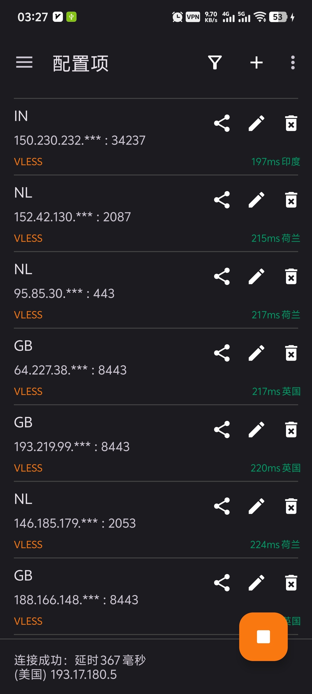

# v2rayNG-mod

A V2Ray client for Android, support [Xray core](https://github.com/XTLS/Xray-core) and [v2fly core](https://github.com/v2fly/v2ray-core)

Forked from [2dust/v2rayNG](https://github.com/2dust/v2rayNG) with the following enhancements:

---

## New Features

### 1. 中文节点归属地显示

在真连接测试（Real delay config）完成后，每个节点的延迟结果旁会自动显示该节点的真实 **IP归属地（中文）**，例如：

底部状态栏的当前连接测试结果也使用中文显示归属地，例如 `(美国) 1.2.3.4`。

归属地查询使用 [ip-api.com](http://ip-api.com)，国内网络可直接访问，支持域名和IP地址自动解析。

### 2. 测试结果自动恢复

底部连接状态栏在显示测试结果后，**8秒后自动恢复**为默认文本（"Connected, tap to check connection" 或 "Not connected"），无需手动清除。

### 3. 禁用 hev-socks5-tunnel 默认启用

`hev-socks5-tunnel` 默认关闭，直接使用 xray-core 内置 VPN 模式，避免因缺少 hev 原生库导致的 VPN 连接失败问题。如需启用可在设置中手动开启。

---

## License
Same as the original project.
